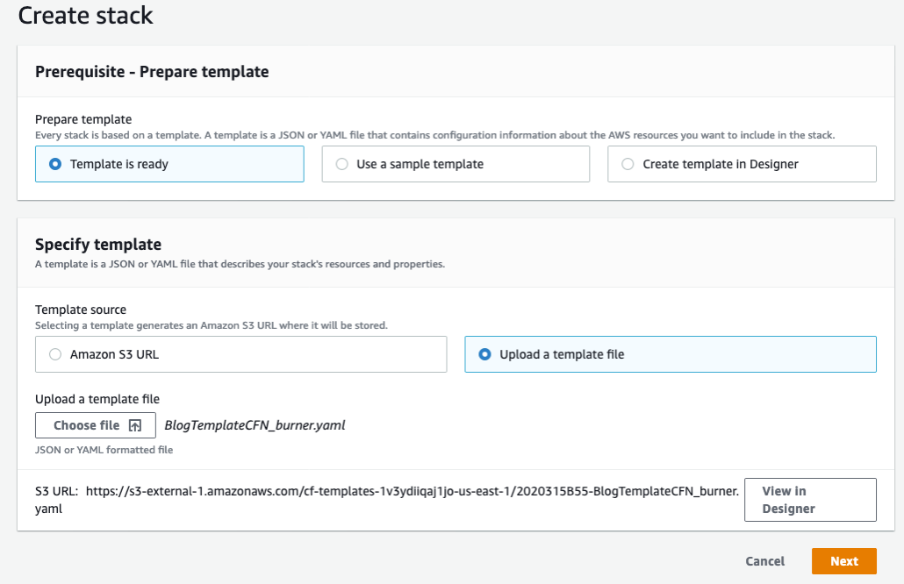
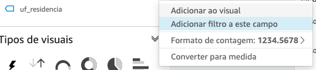
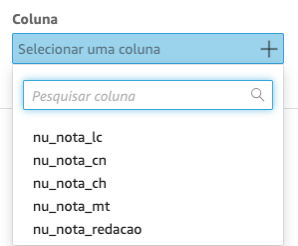

# National Education Exam - Analytics Lab

The purpose of this document is to describe how to prepare a data analytics lab in AWS using as a source result data from Brazil's national exam, called ENEM. Brazilian National High School Evaluation (ENEM) has been created to evaluate the knowledge of students who have graduated from High School, and it's been taken by millions of brazilian students each year.

The results of the exam are provided yearly in a low-granularity dataset stored in INEP institute, responsible for the exam, in its [site](http://portal.inep.gov.br/web/guest/microdados). 

At the end of this lab, you will have a data analytics repository on which you can continue to evolve into more analysis and explorations, deriving more insights. You will be leveraging [AWS Glue](https://aws.amazon.com/glue/) for the data catalog; [Amazon Athena](https://aws.amazon.com/athena/) to query the data, create views and summary table; and [Amazon QuickSight](https://aws.amazon.com/quicksight/) for data visualization.

Below is the architecture of this solution:


# Summary

* [Prerequisites](#prerequisites)
* [Creating services for data and ingestion](#creating-services-for-data-and-ingestion)
* [Running the notebook to ingest data](#running-the-notebook-to-ingest-data)
* [Create summary view and table in Athena](#create-summary-view-and-table-in-athena)
* [Creating our Analysis](#creating-our-Analysis)
* [Adding Filters and Drill Elements to Quicksights](#adding-filter-and-drill-elements-to-quicksight)
* [Conclusion and Next Steps](#conclusion-and-next-steps)
* [References](#references)

## Prerequisites

* Basic knowledge of AWS foundational services such as IAM and S3, as well as basic SQL knowledge.
* AWS account with admin privileges.

## Creating services for data and ingestion

As a first step we will execute a template in Cloudformation which creates a stack that configures the following services:

| Service          | Description                                                                       |
| ---------------- | --------------------------------------------------------------------------------- |
| AWS Glue         | Creates the database and the service role for the Crawler                         |
| Amazon S3        | Creates two buckets: one for the Athena query output, and other to store the data |
| Amazon SageMaker | Creates an Instance Notebook where the download/ingestion procedure will run      |
| Amazon Athena    | Creates the Workgroup to execute the queries                                      |

[Cloudformation link](templates/EduLabCFN.yaml)

When you upload the template for the stack in AWS **Console > Cloudformation**, it will request that you provided the parameters that will define the bucket names, an IAM service Role for Glue and the database name. 



*Obs: You can use your services already configured (like Athena and S3 buckets) if you prefer, just ensure you will update the names in the notebook accordingly*

## Running the notebook to ingest data

After creating the stack, you can now go to the notebook instance area in the AWS Console Sagemaker, under **Notebook> Notebook instances**. There you will find the instance previously created, and you can click on *"Open JupyterLab"* to open the Notebook. 

Open the notebook at **aws-edu-exam-analytics/notebooks/**. Check the instructions before each cell, and make the appropriate changes to the variables related to bucket names, Glue service Role and database name, and then you can run the notebook.

It takes some time to run, in the end it loads all 8 years of zip packages listed in the instance, unzips the data, converts to utf-8, compresses the csv to gzip and uploads it to the defined S3 bucket. Then at the end the database is created in Glue and the Crawler will register 8 tables, one for each year.

After download data and run the crawler step on the notebook, you can already see in AWS Glue, in the table area of the “Database” section, all tables for each year of ENEM, ready for use:


You can also check in the S3 data bucket where there should be a folder for each file, compressed to approximately 20% of its original size, which significantly reduces the space used on Amazon S3, as can be seen on the console:


## Create transformation orchestration

At the end of the execution of the entire notebook, we run the autommated orchestration on Amazon Step Functions. It is going to run Glue Job to aggregate data from all years and update our catalog. Bellow is the our state machine. Futher, you can customize the solution to run scheduled ETL jobs.


This job is then performed in some minutes, creating a table of more than 55 million rows for 8 years of result data. If you want, you can browse the Amazon S3 bucket to see the created files in the [parquet](https://parquet.apache.org/) format, which will compress the data, maintaining and even improving in some cases the performance of the queries, as well, you can check the table list in the AWS Glue catalog.

## Create summary view and run queries on Athena

Now go to Athena Query Editor on the AWS Console. First, click on the Workgroup tab and switch to the one you created on the stack.

Then you can select the name you created in previous steps in the "Database" option of the Query Editor, and you should now be able to see the list of registered tables. If you want to click on the three dots next to a table name and request a preview of it, it will run a query for the first 10 lines. Check that it is working.


Create a view to unify the tables and their fields in the consolidated view.

Run the following command from the Amazon Athena console:

``` 

CREATE OR REPLACE VIEW vw_enem_microdados_summary AS 
select     nu_inscricao, nu_ano, uf_insc as uf_residencia, case tp_sexo when 0 then 'M' when 1 then 'F' end as tp_sexo, idade, nu_nota_redacao,
        nu_nt_cn as nu_nota_cn, nu_nt_ch as nu_nota_ch, nu_nt_lc as nu_nota_lc, nu_nt_mt as nu_nota_mt
from enem_microdados_2012
UNION
select     nu_inscricao, nu_ano, uf_residencia, tp_sexo, idade, nu_nota_redacao,
        nota_cn as nu_nota_cn, nota_ch as nu_nota_ch, nota_lc as nu_nota_lc, nota_mt as nu_nota_mt
from enem_microdados_2013
UNION
select     nu_inscricao, nu_ano, uf_residencia, tp_sexo, idade, nu_nota_redacao,
        nota_cn as nu_nota_cn, nota_ch as nu_nota_ch, nota_lc as nu_nota_lc, nota_mt as nu_nota_mt
from enem_microdados_2014
UNION
select     nu_inscricao, nu_ano, sg_uf_residencia as uf_residencia, tp_sexo, nu_idade, nu_nota_redacao,
        nu_nota_cn, nu_nota_ch, nu_nota_lc, nu_nota_mt
from enem_microdados_2015
UNION
select     nu_inscricao, nu_ano, sg_uf_residencia as uf_residencia, tp_sexo, nu_idade, nu_nota_redacao,
        nu_nota_cn, nu_nota_ch, nu_nota_lc, nu_nota_mt
from enem_microdados_2016
UNION
select     nu_inscricao, nu_ano, sg_uf_residencia as uf_residencia, tp_sexo, nu_idade, nu_nota_redacao,
        nu_nota_cn, nu_nota_ch, nu_nota_lc, nu_nota_mt
from enem_microdados_2017
UNION
select     nu_inscricao, nu_ano, sg_uf_residencia as uf_residencia, tp_sexo, nu_idade, nu_nota_redacao,
        nu_nota_cn, nu_nota_ch, nu_nota_lc, nu_nota_mt
from enem_microdados_2018
UNION
select     nu_inscricao, nu_ano, sg_uf_residencia as uf_residencia, tp_sexo, nu_idade, nu_nota_redacao,
        nu_nota_cn, nu_nota_ch, nu_nota_lc, nu_nota_mt
from enem_microdados_2019;
```

Running the above SQL command, you can see in the left pane on the Athena object list that now there is a view, that you can also use.

## Prepare Quicksight and upload data in SPICE

Select in AWS Console the Amazon Quicksight service now, we will use the previously created summary table for our visual analysis and exploration of ENEM students' grades over the years.

If this is your first time to connect to [Amazon Quicksight](https://aws.amazon.com/quicksight/), you will need to register and choose the edition (Standard or Enterprise), in addition to give a name to the account.

1. In the Security Setting, check the access to the **Amazon S3** bucket that you created with the data, and the bucket created for the Athena query output, with write permission for the workgroup, as shown below:


The account should now be created. As a next step, load the summary table into SPICE, the Amazon Quicksight in-memory high performance repository.

Important: the data occupies about 9GB of SPICE data, so you need to go to the account management (option “Acquire more capacity”) and allocate enough space to store this data:


2. In the initial menu, go to "Data Set", and click to create a new data set. There are several sources of data that can be used, we will ingest data through Amazon Athena.

3. Choose "Athena", choose the workgroup created in the Cloudformation stack and then give a name to the data source, selecting the database and the table:


When finished choosing, click on Edit / View data. In the data source preview and editing screen, you should see the fields and the data types defined.

4. Change the data type for nu_inscricao field to String, and check SPICE as de query mode:

   
                    


5. Conclude the dataset creation by clicking on ‘Save’, which will start the import (see figure below with the load status), where you can monitor until it is completed. Now we can start analyzing and building our analysis.

   
   

## Creating our Analysis in Quicksight

On the Amazon Quicksight home screen, click on "Analysis" and "New Analysis". Choose the data set that was just loaded, and click on “Create Analysis”.

The first step is to create calculated fields to assist in data views, which allows you to be able to present information in different ways, making transformations in SPICE or in analysis time. 

Some ways to do this could be by creating additional fields in the Amazon Athena view, reloading the parquet file again, and then updating Amazon Quicksight. It is also possible to do it in Amazon Quicksight, Edit menu and option to create the fields in the dataset. Another option is to create calculated fields in the view itself, which will be the method we will use here.

We will create 4 fields: the **age group** will allow the definition of a more compact number and better exploitation of the participants' ages, since the original information in the age field stratifies this data a lot, making it difficult to visualize. To count how many participated in ENEM, we used a rule to calculate the **qt_participant** who considers participant the one who was evaluated in at least one of the assessment areas: CH, CN, MT, LC. The **abstention rate**, on the other hand, was calculated with the ratio between the number of participants and the enrollment count (field nu_inscription). We also created a field with information about the **geographic region** of Brazil, through the appropriate groupings of the UF fields (uf_residencia).

1. Click (+) Add Calculated Field, and create the following field as described in the table below: 


| **Field Name**   | **Code**                                                                                                                                                                                                                                                                                                           |
| ---------------- | ------------------------------------------------------------------------------------------------------------------------------------------------------------------------------------------------------------------------------------------------------------------------------------------------------------------ |
| faixa etaria     | `ifelse(idade<=18,'18 anos ou menos', idade<=20,'19 a 20 anos',idade<=30,'21 a 30 anos', idade<=59,'31 a 59 anos','60 anos ou mais')` |
| regiao           | `ifelse(locate('SP RJ MG ES',{uf_residencia},1)<>0,'Sudeste', locate('RS PR SC',{uf_residencia},1)<>0,'Sul', locate('MT MS GO DF',{uf_residencia},1)<>0,'Centro Oeste', locate('AC AM RO RR AP PA TO',{uf_residencia},1)<>0,'Norte', locate('MA PI BA PE CE PB RN AL SE',{uf_residencia},1)<>0, 'Nordeste','N/A')` |
| qt_participantes | `ifelse(isNotNull({nu_nota_ch}) OR isNotNull({nu_nota_cn})  OR isNotNull({nu_nota_mt}) OR isNotNull({nu_nota_lc}),1,0)` |
| tx_abstencao     | `1-(sum({qt_participantes})/count({nu_inscricao}))` |

For the creation of the fields you will use the calculated field editor, where there are dozens of functions available, which allow you to quickly create new fields with rules, thus speeding up your data exploration process. The calculated field editor received a recent update ([link](https://aws.amazon.com/about-aws/whats-new/2020/08/amazon-quicksight-launches-folders-a-new-calculations-editor-experience-and-more/)) with a new interface that allows auto-complete, syntax highlighting and a quick search reference for functions, parameters and fields on the right side of the screen.

Now we will create an example dashboard, working with the exam results information. We will have two tabs, one with all years data, and a detailed tab for a year.

2. Click (+) in the upper left of the screen and select “Add Visual”, You can choose the icon of a visual shape from the pane named “Visual Types”:


Below are screenshots of each tab, and a table describing how they should be defined, specifying the visual type and which options should be chosen:

**Tab 1: Overview**


| **Visual Title**                                                                                                        | **Visual Type**           | **Options**                                                                                                                                                                                                   |
| ----------------------------------------------------------------------------------------------------------------------- | ------------------------- | ------------------------------------------------------------------------------------------------------------------------------------------------------------------------------------------------------------- |
| Inscritos e participantes por ano x Taxa de Abstenção                                                                   | Clustered bar combo chart | X Axis: nu_ano (sort ascending)<br> Bars: nu_Inscrição (Count), Qt_participantes(Sum)<br>Lines: tx_abstencao (Personalized)<br>**Obs: choose tx_abstencao as a percentage**                                   |
| Média CH<br>Média CN<br>Média LC<br>Média MT<br>Média Redação<br><br> **Obs: Create 5 Visuals, 1 for each title above** | Vertical bar chart        | X Axis: nu_ano (ordem crescente)<br>Valor: nu_nota_ch (Média), <br> nu_nota_cn (Média), <br> nu_nota_lc (Média), <br>nu_nota_mt (Média), <br> nu_nota_redacao (Média)<br>**Obs: 1 value for each created visual** |

You can now change some layout features of the visuals by clicking on the gear that appears when selecting the visual. There will be several options through which you can name the title, change axis intervals and add data labels, as well as adjust their fonts.

Tip: for the visuals that are repeated (like the averages above), create a single view, adjust all the formatting and settings and duplicate it as many times as you need. To do this, click on the three points and select “duplicate visual”, and then just change the value. This speeds up the process.

3. Add a new tab selecting the plus sign (+) besides first tab Title on the top:

**Tab 2: Details by State**


| **Title**                                                                                                                                                                                                  | **Visual Type**      | **Options**                                                                                                                                                                                    |
| ---------------------------------------------------------------------------------------------------------------------------------------------------------------------------------------------------------- | -------------------- | ---------------------------------------------------------------------------------------------------------------------------------------------------------------------------------------------- |
| Médias por região e UF                                                                                                                                                                                     | Pivot Table          | Lines: região, uf_residencia<br> Columns: nu_ano<br> Values: nu_nota_ch (Average), <br> nu_nota_cn (Average), <br> nu_nota_lc (Average), <br> nu_nota_mt (Average), <br> nu_nota_redacao (Average) |
| Participantes por faixa etária                                                                                                                                                                             | Horizontal bar chart | Y Axis: faixa etária<br> Value: qt_participante(Sum)                                                                                                                                           |
| Participantes  por sexo                                                                                                                                                                                    | Donut Chart          | Group/Color: tp_sexo<br> Value: qt_participante(Sum)                                                                                                                                           |
| Distribuição de notas CH<br>Distribuição de notas CN<br> Distribuição de notas LC<br> Distribuição de notas MT<br> Distribuição de notas Redação<br> <br>**Obs: Create 5 Visuals, 1 for each title above** | Histogram            | Valor: nu_nota_ch (Average)<br> nu_nota_cn (Average)<br>nu_nota_lc (Average)<br> nu_nota_mt (Average)<br> nu_nota_redacao (Average)<br><br> **Obs: 1 value for each created visual****         |

Tip: duplicate the histograms in a similar way to what you did in the previous tab, and config them for 30 compartments (in the visual options) to make the look more granular.

Also take the opportunity to adjust numeric formatting options, where you can place more or less decimal places, or reduce the number shown to the thousands or millions, making presentation easier to read.

## Adding filter and drill elements to Quicksight

We are now going to add filter and drill elements to the analysis, so the users can get a better experience exploring it. 

1. In Tab 1 (Overview) in the options on the right side of the screen, choose View, and click on the 3 points next to the uf_residencia field, and choose to add a filter to this field:



2. You will be taken to the “Filter” section, clicking on the three points next to the created filter, select Edit, and in the option above that appears, place “All Visuals” for your filter to be applied across the entire tab:


3. Click the Apply button and then Close, e click again on the three points but now select “add to sheet”.


Note that it's been added a control on the screen, which you can move and arrange in any way you want. 

4. We want to keep this control at the top of the screen, so click on the three points on the control, and select "Pin to Top" from there. Click on "Edit" and switch to the single selection filter, then click on "Apply":


You now have a control that allows you to see all the visual elements of this tab through a filter by State, make a test and choose one, and it will apply it to the analysis.

Now let's go to the second tab (State Details Tab), and add a filter for the year, in the same way as the procedure for the first tab: select the nu_ano field and click on add filter, change to apply the filter to all visuals. You will also need to set a default value here, put “2019”, and then create the control and place it as a slider, then fix it to the top of screen. You can now filter this tab by year.

Now we will add conditional formatting to the pivot table, which will allow an easy visualization of the highest and lowest grades in average per State.

5. Click on the three points besides the pivot table, and choose “Conditional Formatting”:


6. Click on plus sign (+), select the field and fill the options for each one of the metrics in a similar way as shown below

   
   
    

Note that the table cells now gradually indicate the lowest and highest notes, allowing easy identification of average grades by State.

Finally, let's create a control that allows you to click on one of the States in the pivot table, and all the visuals on the tab will be filtered by that State you selected.

7. Select the pivot table, in the left pane go to “Actions”. Click on plus sign (+) and fill as described here:


8. Click Save, and now try to select one of the State in the Pivot Table. Note that all visuals are filtered by that selection. If you want to return without selection, just click it again.

You can now publish it as a dashboard and make it available for users to use it, exploring the filters and views.

9. Click “Share” in the upper right of screen, and choose “Publish Dashboard”. 

This way you are making a dashboard available to be viewed by other users, with several filter and exploration features configured.

## Conclusion and Next Steps

In this repository we have shown how to develop a data load process for education, making it available on a dashboard that allows you to follow the evolution of enrollments, abstention rate and grades from ENEM exam, as well as explore grade averages by region and State, year by year. In the overall or State view, it is possible to see the stratification of students by gender and age group, as well as the distribution of grades.

As next steps, the possibilities are diverse, including data enrichment (adding geolocation and demographic information of the localities, for example), including new views and navigation and exploration actions, in addition to using machine learning on the data from the socioeconomic questionnaire responses.

## References

Microdados - INEP

http://inep.gov.br/microdados

Best Practices When Using Athena with AWS Glue

https://docs.aws.amazon.com/athena/latest/ug/glue-best-practices.html

Amazon QuickSight 

https://aws.amazon.com/quicksight

Apache Parquet

https://parquet.apache.org

## Security

See [CONTRIBUTING](CONTRIBUTING.md#security-issue-notifications) for more information.

## License

This library is licensed under the MIT-0 License. See the LICENSE file.
